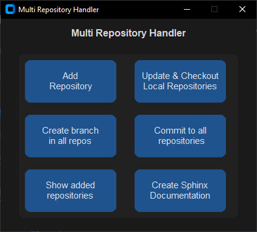

# Multi repository handler

This is a tool to handle multiple repositories at once.
 - You can add a new repository to the list.
 - You can clone all repositories in the list.
 - You can pull all repositories in the list.
 - You can push all repositories in the list.
 - you can remove a repository from the list.
 - You can create a new branch in all repositories in the list.
 - You can generate a sphinx-documentation for all repositories in the list.

## Setup

 - Clone this repository.
 - Install Git  
 - Install Python 3.10 or higher (Recommended to use `conda` or `miniconda`)
 - cd to the folder xrepos
 - create a venv
 - Install requirements: `pip install -r requirements.txt`
 - launch main.py

## In case of issues
- In case of issue check the log in the folder log and use it to report the issue

## The build website:
- Once you launch the main.py, the sphinx build will be zipped with your password and found in the folder build

## Known issues
- When the file path is too long, Sphinx cannot generate the documentation. This is a known issue in Sphinx. The workaround is to move the repository to a shorter path.

